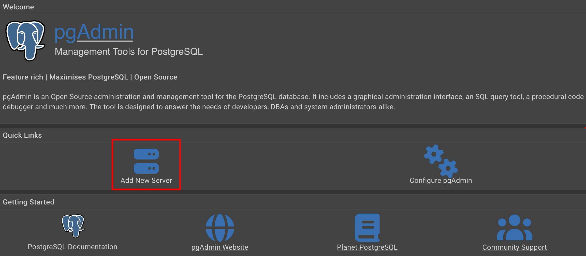
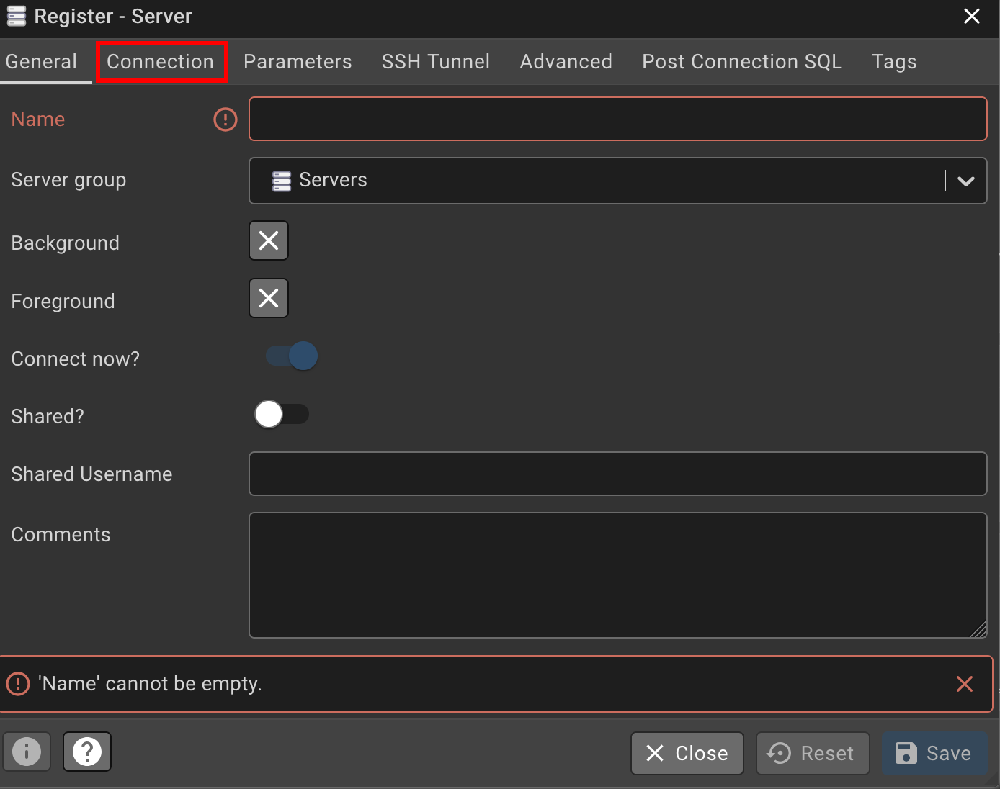

# Minimal PostgreSQL / PGAdmin / Migrator Docker Setup
This repository provides a minimal setup for running PostgreSQL, PGAdmin, and a database migrator using Docker and Docker Compose. Is serves the main purpose to quickly pull up a versatile environment to test and develop small schemas. It was created for a lecture on databaess in uni.

## Prerequisites
- Docker
- Docker Compose
- Basic knowledge of Docker and Docker Compose

## Setup Instructions
1. Clone the repository:
   ```bash
   git clone
   ```
2. Navigate to the project directory:
   ```bash
   cd postgres_pgadmin_container/deployment
   ```
3. Run the Docker Compose setup:
   ```bash
   docker-compose up -d
   ```
   Note that the `-d` flag runs the containers in detached mode, meaning they will run in the background. Leaving it out will show the logs in the terminal.

## Services
- **PostgreSQL**: The database server.
- **PGAdmin**: A web-based administration tool for PostgreSQL.
- **Migrator**: A service to handle database migrations.

## Accessing PGAdmin
- Open your web browser and navigate to `http://localhost:8080`.
- Log in using the following credentials:
  - Email: `admin@admin.de`
  - Password: `admin`

## Adding a new server in PGAdmin:

After logging in, add a new server by clicking on "Add New Server". If you don't see this option, right-click on "Servers" in the left sidebar and select "Create" -> "Server...".


After typing in a name in the general tab, go to the "Connection" tab via the navigation bar of the "Create - Server" dialog box.

### Connection details:
- Host name/address: `db` (this is the service name defined in the Docker Compose
- Port: `5432`
- Maintenance database: `postgres`
- Username: `postgres`
- Password: `test1234`

## Stopping the Services
To stop the services, run:
```bash
docker-compose down
```

## Logging
To view the logs of a specific service, use:
```bash
docker-compose logs <service_name>
```
Replace `<service_name>` with `minimal-postgres`, `minimal-pgadmin`, or `minimal-db-migration`.


## Notes
- Make sure to adjust the environment variables in the `docker-compose.yml` file as needed.
- This setup is intended for development and testing purposes. For production use, consider additional security and configuration measures.
